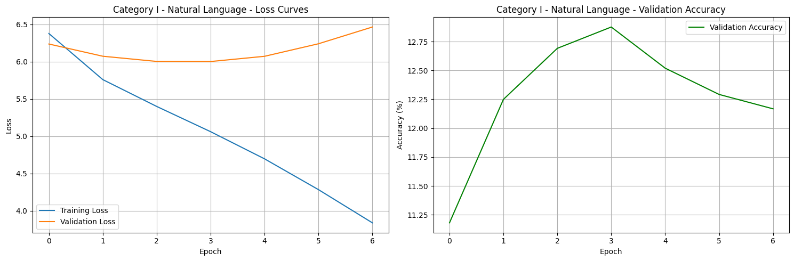
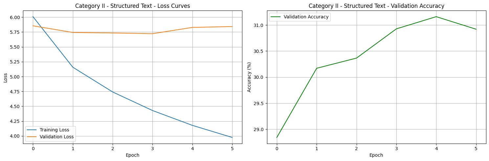
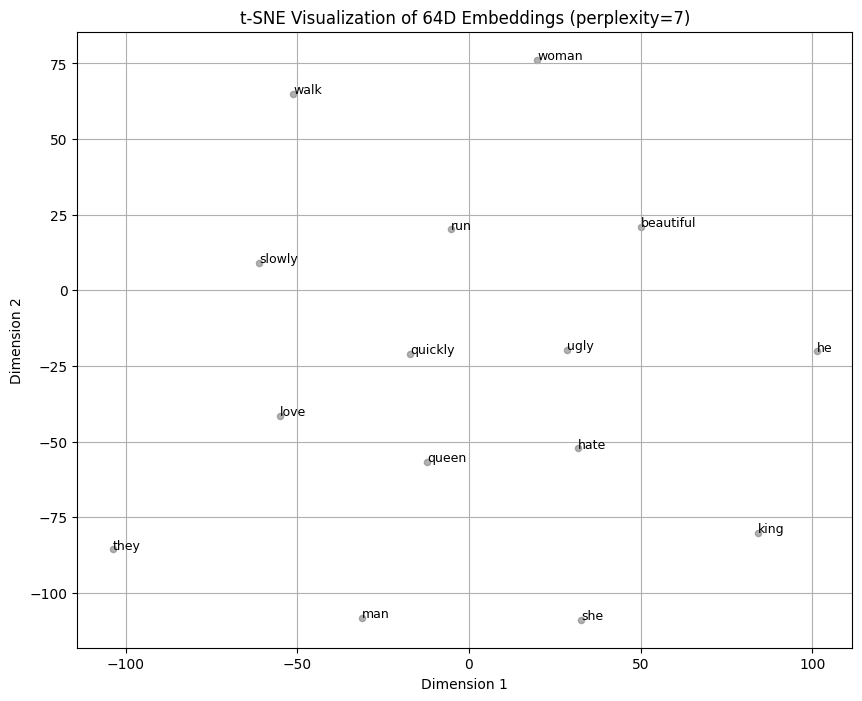
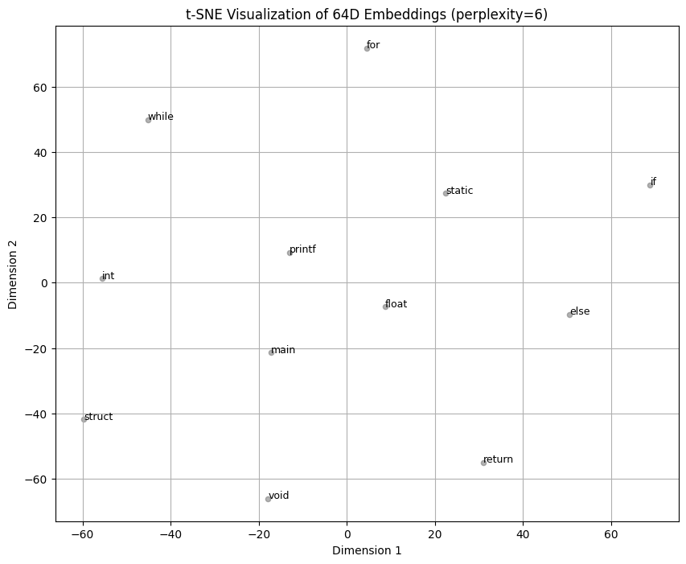

# Comparative Analysis: Category I (Natural Language) vs Category II (Structured Text)

## Dataset and Vocabulary

| Aspect          | Category I – Natural Language       | Category II – Structured Text |
| :-------------- | :---------------------------------- | :---------------------------- |
| Corpus          | *The Adventures of Sherlock Holmes* | *Linux Kernel Source Code*    |
| Total Words     | 107,510                             | 759,639                       |
| Vocabulary Size | 10,490                              | 113,645                       |
| Training Pairs  | 116,531                             | 833,044                       |

**Observations:**

* The structured text dataset is significantly larger and more repetitive, with clear syntactic rules and limited ambiguity.
* Natural language exhibits a smaller vocabulary but higher contextual diversity and unpredictability, making next-word prediction harder.

---

## Model Performance

| Metric              | Category I | Category II |
| :------------------ | :--------- | :---------- |
| Model Parameters    | 12.8M      | 125.1M      |
| Optimal Epoch       | 3          | 3           |
| Validation Accuracy | 12.69%     | 30.92%      |
| Validation Loss     | 6.00       | 5.73        |

**Training Dynamics:**

* Category I showed slow improvement and early overfitting due to semantic variability and limited context regularity.
* Category II achieved higher accuracy and more stable convergence, reflecting higher context predictability inherent to code syntax.

**Loss and Accuracy Trends:**

* Category I:

 Gradual training loss reduction with minimal validation gain, indicating underfitting on semantically complex data.

* Category II: 

Smooth convergence and consistent validation trends, showing effective pattern learning from structured input.

---

## Qualitative Generations

| Context                    | Category I Output                                      | Category II Output                    |
| :------------------------- | :----------------------------------------------------- | :------------------------------------ |
| “the man was very”         | “thin the matter of the trap are to close me...”       | –                                     |
| “sherlock holmes took his” | “hand in one of the furniture un there must escape...” | –                                     |
| “static void main string”  | –                                                      | “static void main string int irq); .” |
| “if config snd hda”        | –                                                      | “if config snd hda goto again; .”     |

**Insights:**

* The natural language model produces coherent but semantically unstable continuations.
* The structured model generates syntactically valid, domain-appropriate completions following C-like structure.

---

## Embedding Visualization

| Aspect           | Category I                                                          | Category II                                                                                 |
| :--------------- | :------------------------------------------------------------------ | :------------------------------------------------------------------------------------------ |
| t-SNE Perplexity | 7                                                                   | 6                                                                                           |
| Observation      | Clusters formed by semantic relations (verbs, pronouns, adjectives) | Clusters organized by syntactic and functional similarity (keywords, data types, operators) |

CATEGORY I

CATEGORY II

**Interpretation:**

* Natural language embeddings reflect **semantic proximity** (e.g., “man–woman–king–queen”).
* Structured text embeddings reflect **syntactic and functional grouping** (e.g., “if–else–for–return”).

---

## Summary: Learnability Insights

* **Natural Language:**

  * High variability and context ambiguity reduce learnability.
  * Requires capturing deep semantics beyond surface-level co-occurrence.
  * Slower convergence, lower validation accuracy.

* **Structured Language:**

  * Deterministic syntax and limited vocabulary improve context predictability.
  * Easier generalization across patterns.
  * Higher validation accuracy and stable loss behavior.

**Conclusion:**
Structured text (Category II) is more learnable for MLP-based next-word prediction due to its rule-based, repetitive nature and predictable token dependencies.
Natural language, being context-rich and semantically diverse, demands deeper sequence modeling architectures (e.g., RNNs or Transformers) for effective learning.

