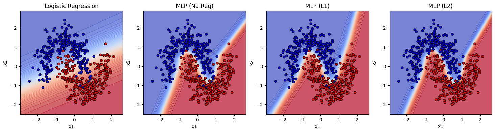
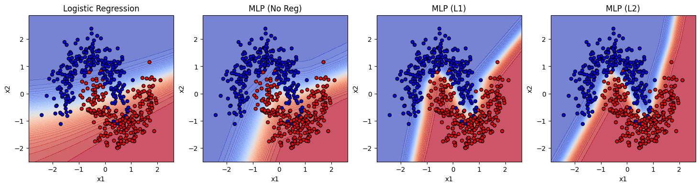

# Task 2: Moons Dataset & Regularization

## Validation Results (Balanced Train Set)

### MLP (No Regularization)

* Early stopping at epoch 535
* Validation AUROC: 0.9952

### MLP + L1 Regularization

* Best λ: 1.0e-06
* Validation AUROC: 0.9956
* Hidden Sparsity: 0.00%, Output Sparsity: 0.00%

### MLP + L2 Regularization

* Best λ: 1.0e-06
* Validation AUROC: 0.9972

### Logistic Regression with Polynomial Features

* Validation Accuracy: 0.8300
* Validation AUROC: 0.9292

## Test Results (Balanced Train Set)

| Model | # Parameters | Accuracy (0.10) | AUROC (0.10) | Accuracy (0.20) | AUROC (0.20) | Accuracy (0.30) | AUROC (0.30) |
|-------|-------------|----------------|--------------|----------------|--------------|----------------|--------------|
| Logistic Regression | 6   | 0.868 | 0.9554 | 0.872 | 0.9453 | 0.834 | 0.9119 |
| MLP (No Reg)        | 65  | 0.998 | 1.0000 | 0.970 | 0.9940 | 0.900 | 0.9601 |
| MLP (L1)            | 65  | 0.998 | 1.0000 | 0.964 | 0.9932 | 0.898 | 0.9596 |
| MLP (L2)            | 65  | 0.998 | 1.0000 | 0.976 | 0.9941 | 0.900 | 0.9584 |

## Decision Boundaries (Balanced Train Set, Balanced Test Set, Test Noise = 0.2)

## Effect of Regularization

### **L1 Regularization**

* Promotes sparsity by driving many weights to zero.
* Creates sharper, more jagged decision boundaries.
* Performs well at low–moderate noise but underfits at higher noise.
* Helps with feature selection but reduces smoothness.

### **L2 Regularization**

* Produces smoother decision boundaries by shrinking weights gradually.
* Improves margin and overall stability.
* Maintains higher AUROC across noise levels.
* Balances flexibility and generalization better than L1.

## Validation Results (Imbalanced Train Set)

### MLP (No Regularization)

* Early stopping at epoch 108  
* Validation AUROC: 0.9316

### MLP + L1 Regularization

* Validation AUROC: 0.994  
* Hidden Sparsity: 9.38% , Output Sparsity: 6.25%

### MLP + L2 Regularization 

* Validation AUROC: 0.9948 

### Logistic Regression with Polynomial Features

* Validation Accuracy: 0.8200 
* Validation AUROC: 0.9248

## Test Results (Imbalanced Train Set)

| Model                   | Noise Level | Accuracy | AUROC  |
|--------------------------|--------------|-----------|--------|
| **MLP (No Regularization)** | 0.1 | 0.8560 | 0.9550 |
|                          | 0.2 | 0.8540 | 0.9499 |
|                          | 0.3 | 0.8260 | 0.9156 |
| **MLP + L1 Regularization** | 0.1 | 0.9940 | 0.9999 |
|                          | 0.2 | 0.9660 | 0.9935 |
|                          | 0.3 | 0.9000 | 0.9613 |
| **MLP + L2 Regularization** | 0.1 | 0.9980 | 1.0000 |
|                          | 0.2 | 0.9660 | 0.9934 |
|                          | 0.3 | 0.8880 | 0.9586 |
| **Logistic Regression (Poly Feat.)** | 0.1 | 0.8780 | 0.9547 |
|                          | 0.2 | 0.8580 | 0.9423 |
|                          | 0.3 | 0.8240 | 0.9081 |

## Decision Boundaries (Imbalanced Train Set, Balanced Test Set, Test Noise = 0.2)

## Effect of Imbalance in Train Dataset

- **Overall performance drop:**  
  Models trained on the imbalanced dataset show slightly lower accuracy and AUROC compared to those trained on the balanced dataset. This indicates that imbalance limits the model’s ability to generalize across both classes effectively.

- **MLP without regularization:**  
  AUROC values drop to around 0.95, suggesting the model struggles to correctly rank positive vs. negative samples when trained with skewed class distribution.

- **L1 and L2 regularized models:**  
  Despite imbalance, these models maintain high AUROC (>0.99) and accuracy (~0.97–1.00 for low noise). Regularization seems to improve generalization and reduce bias toward the majority class.

- **Impact under noise:**  
  At higher noise levels (0.3), performance degradation is more noticeable. Accuracy drops by 6–10%, showing that models trained on imbalanced data are less robust to noisy inputs.

- **Logistic Regression:**  
  Shows lower accuracy (~0.85) and AUROC (~0.94) across all noise levels, highlighting that simpler linear models are more sensitive to imbalance and lack the capacity to capture minority class patterns.

**In summary:**  
Imbalanced training causes models—especially unregularized or linear ones—to favor the majority class, reducing overall robustness and balanced decision-making. Regularization (L1/L2) mitigates this effect to some extent by improving generalization and stabilizing boundaries.
